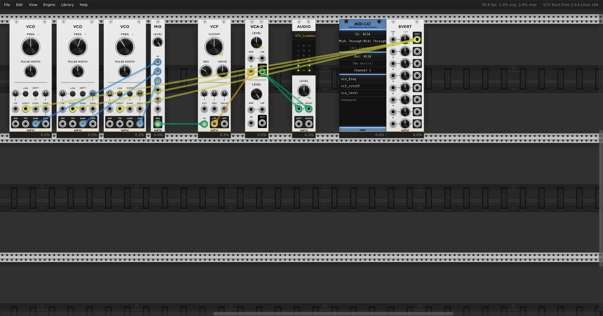

# tt-cv-agency

A model, running on Tenstorrent hardware, in the decision loop of a synthesizer:
listen to the live audio, decide a CV adjustment toward a goal, write it back,
repeat. Built and proven against VCV Rack first; the CV backend is deliberately
abstracted so the same code should transfer to a real Eurorack system through
Expert Sleepers CV/audio interfaces later — the basics learned here with a
VCO/VCA/LFO/EG-style patch are meant to carry over to more exotic modules too.

**Status: work in progress, past first full pass.** Phase 1 (a plain, zero-ML
CV/audio bridge) is done and verified against live hardware. Phase 2 (a small
model trained and run via `ttnn` on a Tenstorrent chip, in the actual control
loop) has all 8 planned steps implemented, tested, and reviewed — feature
extraction, the `CVBackend`/`VCVRackBackend` pair, data collection, the
inverse-regression model, `TTInferenceEngine` (TTNN inference on real
hardware), `run_control_loop` (the closed loop itself), and a live
end-to-end verification against the running patch. A final whole-branch
review found and fixed a real correctness bug in the pitch feature; a
follow-up pass then discovered the committed patch's MIDI-CAT mapping had
never actually been saved (rebuilt by hand-authoring it directly into the
patch JSON — see `CLAUDE.md`), recalibrated the brightness normalization
against real measured data, and recollected the full 3000-sample dataset.
The pipeline works end-to-end on real hardware with no exceptions; two of
three target features (`vco_freq`, `vca_level`) now train to R² > 0.95, and
live control-loop error tightened across the board — but Phase 2 is not yet
a full "hits every goal" result, and brightness in particular still misses
its goal more often than not. `CLAUDE.md`'s final sections have the
detailed diagnosis.

## Why VCV Rack first

VCV Rack is free, fast to iterate in, and infinitely patchable — a good stand-in
for a modular synth before touching real hardware. Everything above the CV/audio
I/O layer (feature extraction, the model, the control loop) is written against a
`CVBackend` interface, not against VCV Rack directly, so a future backend that
talks to a real audio interface's DC-coupled CV outputs should be able to reuse
all of it.

## Results so far

**Phase 1 — the plain I/O bridge, no ML:** a Python process reads VCV Rack's live
audio (via a PipeWire loopback) and writes its CV (via MIDI-CAT) in real time.
Confirmed with a real MIDI CC sweep measured against actual captured audio, not
just visual inspection:

| CC value | measured RMS |
|---|---|
| 0 | 0.00 |
| 32 | 0.00 (near-silent at low VCA level, expected) |
| 64 | 3014.12 |
| 96 | 6029.75 |
| 127 | 9042.26 |

Evenly-spaced control values produce evenly-spaced audio response — a real
closed loop, not a coincidence.

**Phase 2:** a 3-feature state representation (loudness, brightness, pitch —
via RMS, spectral centroid, and autocorrelation) extracted from live audio; a
random CV sweep against the real running patch (500 samples); a small
inverse-regression model (3→32→32→3, ReLU) fit to that data; `TTInferenceEngine`
running that model's weights on a real Tenstorrent chip via `ttnn`; and
`run_control_loop` closing the loop (read audio → extract features → infer CV
→ write CV → repeat) against the live patch. (Since Stage 0 — see
`CLAUDE.md` — this per-instant 3-feature read has been replaced by a windowed
6-feature `[mean, std]` aggregation over a whole loop/period, feeding a
patch-agnostic model sized to whatever `(n_features, n_channels)` the current
patch and config define, not a fixed `3→32→32→3`.)

A final whole-branch review found and fixed a genuine bug in
`estimate_pitch`: at the real production `block_size` (1024 samples), its
peak search started inside the still-descending autocorrelation main lobe
for any fundamental below ~440 Hz, so it silently returned a constant
clipped-to-`fmax` value instead of the real pitch. Confirmed real-world
impact: 52% of the original 500-sample dataset's `pitch` column was that
constant artifact, and `corr(vco_freq, pitch) = -0.29` (the feature moved
the *wrong way* from the knob that controls it). After the fix and a fresh
500-sample collection: the clip-artifact rate dropped to 2.4%, and
`corr(vco_freq, pitch) = +0.797`.

Retrained on the corrected dataset with an 80/20 held-out validation split,
reporting per-channel MSE/R² (against a predict-the-mean baseline) instead
of one aggregate in-sample number:

| CV channel | held-out MSE | held-out R² |
|---|---|---|
| `vco_freq` | 0.0234 | 0.7085 |
| `vco_fm` | 0.0659 | 0.1001 |
| `vca_level` | 0.0168 | 0.8034 |

`vco_fm`'s low R² is not an unpatched-input artifact — its FM input is
confirmed patched to an LFO in the live patch — more likely the LFO's
rate/depth just doesn't move any of the three features much within a
single ~21ms audio block.

Re-running the same live 3-goal end-to-end verification with the fixed
pitch estimator and retrained model: loudness converges in 2 of 3 goals,
brightness still doesn't converge in any (unchanged, root cause still
open), and pitch — which previously moved in a non-monotonic,
goal-independent way — now tracks the goal monotonically and converges in
1 of 3.

**Follow-up pass:** relaunching VCV Rack to recollect data surfaced a more
basic gap — the committed patch's MIDI-CAT mapping had only ever existed in
a live, never-saved Rack session, so a fresh clone had no working CV control
at all. Rebuilt it by hand-authoring the MidiCat module directly into the
patch's JSON (the same technique Phase 1 used to build patches
programmatically) — verified with a real CC sweep against measured RMS, not
just "no error thrown." Also recalibrated `BRIGHTNESS_REF_HZ` (12000.0 →
7000.0) against a 150-sample real measurement of this patch's achievable
spectral-centroid range, then recollected the full 3000-sample dataset (the
`n_samples=3000` default had never actually been exercised before — every
prior run used 500).

Retrained on 3000 samples: `vco_freq` R² 0.71→0.95, `vca_level` R² 0.80→0.99.
`vco_fm`'s R² is now ~0 — and this time fully explained rather than merely
suspected: the rebuilt patch has nothing wired into the VCO's FM input at
all, so that channel is genuinely unobservable in the current patch, not
just weakly modeled. Live 3-goal verification tightened across the board
(e.g. pitch error on the two non-converging goals roughly halved), though
the convergence-threshold pass count barely moved — most of the improvement
landed as "closer but still outside 0.05," not new passes. Brightness
remains the weakest dimension; the recon data suggests part of that may be
an intrinsically hard target rather than a pure modeling gap (the real
achievable spectral-centroid distribution is heavily skewed toward low
values). Full numbers and the complete honest read are in `CLAUDE.md`'s
"MIDI-CAT mappings were never actually committed" section.

**Instrument upgrade:** built `patches/minimoog_test.vcv`, a proper
Minimoog-equivalent (3 detuned VCOs → mixer → filter → amp) to replace the
single-oscillator test patch as the foundation for future experiments —
see "Minimoog-equivalent patch" in `CLAUDE.md` for the design and a real
oscillator-tracking bug caught and fixed along the way.

## Progress journal

`docs/journal/` holds dated screenshots of the patch as it's evolved —
a quick visual record alongside the prose history in `CLAUDE.md`.

| date | screenshot |
|---|---|
| 2026-09-07 | [Minimoog-equivalent patch](docs/journal/2026-09-07-minimoog-patch.png) — 3xVCO → Mixer → VCF → VCA, MIDI-CAT mapping vco_freq/vcf_cutoff/vca_level |
| 2026-09-07 | [Sequencer + LFO foundation](docs/journal/2026-09-07-sequencer-patch.png) — adds a self-clocked SEQ3 sequencer, a filter-sweep LFO, and a filter-envelope ADSR (Stage 0 of the roadmap in `CLAUDE.md`); 8 MIDI-CAT channels total |

## What's here

- `backends/base.py` — the `CVBackend` abstract interface (`set_cv`,
  `read_audio_block`, `channels`, `last_known_cv`) and `FakeCVBackend`, an
  in-memory test double.
- `backends/vcv_rack.py` — `VCVRackBackend`, the real implementation: MIDI-CAT
  CV output over a MIDI loopback port, audio capture from a PipeWire loopback
  sink via a persistent `sounddevice` stream.
- `patches/bridge_test_mapped.vcv` — the original single-VCO test patch:
  the base test patch plus a MIDI-CAT module with
  `vco_freq`/`vco_fm`/`vca_level` mapped to CC 1/2/3. `patches/bridge_test.vcv`
  stays an unmodified clean slate for future OSC'elot/MIDI-CAT debugging.
- `patches/minimoog_test.vcv` — a proper Minimoog-equivalent (East Coast)
  subtractive-synthesis foundation: 3 detuned `VCO`s → `Mixer` → `VCF` →
  `VCA`, with `vco_freq`/`vcf_cutoff`/`vca_level` as the CV-controllable
  channels. `vcf_cutoff` replaces the old patch's dead `vco_fm` channel with
  a real, always-effective brightness control. See `CLAUDE.md` for the
  full design, the module-source verification, and a real tracking bug
  this uncovered and fixed along the way.
- `patches/sequencer_test.vcv` — Stage 0's temporal instrument: the Minimoog
  patch extended with a self-clocked `SEQ3` sequencer, a filter-sweep `LFO`,
  and a filter-envelope `ADSR`, 8 MIDI-CAT channels total. See CLAUDE.md's
  Stage 0 sections for the full design and verification.
- `configs/bridge_test.yaml` / `configs/minimoog_test.yaml` /
  `configs/sequencer_test.yaml` — channel → MIDI CC mapping for each patch,
  so no channel identity or CC number is hardcoded in Python.
- `features.py` — loudness (RMS), brightness (spectral centroid), and pitch
  (autocorrelation) feature extraction, each normalized to roughly `[0, 1]`;
  `extract_features_aggregated` reduces a whole window of blocks to a 6-dim
  `[mean, std]` per feature, so a windowed read of a looping/temporal patch
  (like `sequencer_test.vcv`) isn't reduced to one random instantaneous
  block.
- `data_collection.py` — sweeps random CV settings against a `CVBackend` and
  logs the resulting `(cv, features)` pairs for training data; each sample
  reads a whole `aggregate_window_s`-long window of audio (not a single
  block) so temporal patches are represented fairly.
- `model.py` — `InverseCVModel` (a small feedforward regressor, parametric in
  both input-feature and output-CV-channel count, mapping target features
  back to the CV settings that should produce them), its PyTorch training
  script (with an 80/20 train/val split and per-channel MSE/R² reporting),
  and `save_weights`/channel-order provenance.
- `tt_inference.py` — `TTInferenceEngine`: loads the trained weights and runs
  the model's forward pass on a real Tenstorrent chip via `ttnn` (always
  behind a `gozer` chip lease). Asserts the loaded weights' recorded CV
  channel order matches the backend's current one before running, so a
  channel-order mismatch fails loudly instead of silently driving the wrong
  physical CV channel.
- `control_loop.py` — `run_control_loop`: the perceive-decide-act loop itself
  (read audio → extract features → infer target CV → step toward it → write
  CV → repeat) against any `CVBackend`.
- `pyproject.toml` — pytest config; registers the `hardware` marker so tests
  that touch `ttnn` are skipped by default and only run explicitly, under a
  `gozer` lease.
- `roundtrip_test.py` — the very first Phase 1 proof script (CC sweep +
  measured RMS).
- `tests/` — the test suite for everything above; `FakeCVBackend` keeps most of
  it runnable without a live VCV Rack instance.
- `docs/superpowers/specs/`, `docs/superpowers/plans/` — the design spec and
  the task-by-task implementation plan this was built from.
- `CLAUDE.md` — a detailed build log: what was tried, what broke, and why —
  worth reading before touching the VCV Rack / PipeWire / MIDI-CAT side of this.

## Notable bring-up details

Getting a plain Python process to reliably read/write a live VCV Rack instance
turned out to be most of the actual work. Highlights (full detail in
`CLAUDE.md`):

- **VCV Rack patches are hand-authorable JSON.** A `.vcv` file is a
  zstd-compressed tar around `patch.json` — patches can be constructed
  programmatically rather than built by hand in the GUI.
- **A recurring "did you crash?" dialog, traced to one string.** Killing Rack
  non-gracefully leaves its log without a trailing `"END"` marker, which trips
  a crash-recovery prompt on next launch — one that renders as a native
  Wayland surface invisible to every X11-based automation tool. Appending
  `"END"` to the log file after a hard kill avoids it entirely.
- **A real PipeWire routing gotcha.** Selecting a named audio device in VCV's
  own UI doesn't reliably make the underlying stream connect to it — the
  system's *default* sink/source needs to be set to the loopback device for
  the routing to actually take effect, independent of what the UI claims.
- **Synthetic mouse clicks aren't full mouse clicks.** `xdotool`-driven clicks
  worked for menus, buttons, and screenshots, but not for VCV's "click any
  parameter to map it" gesture specifically — that one needed a real human
  click. Everything else about patch-building stayed scriptable.
- **A real, caught-before-it-mattered bug:** an early version of the audio
  capture buffered blocks in an unbounded queue, so it silently returned
  audio from *before* the most recent CV change rather than current audio.
  Caught by comparing live RMS measurements against expectation rather than
  trusting "no errors thrown" — fixed by bounding the queue to the single
  latest block.

## Requirements

Python 3.12, `torch`, `ttnn` (from a `tt-metal` checkout), `mido`,
`sounddevice`, `numpy`, `scipy`, `PyYAML`, `pytest`. VCV Rack (free edition) is
the current test instrument, with the [MIDI-CAT](https://github.com/stoermelder/vcvrack-packone)
module mapped to the patch's CV-controllable parameters over a MIDI loopback
port.

Any `ttnn` use goes through a chip lease (`gozer`, this machine's cooperative
Tenstorrent chip-leasing tool) — never a bare unleased `import ttnn`.
